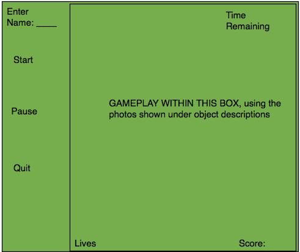

# Game Design Doc
## Balloon Blast
### Haley Lenner
#### CSCI102 T/Th 12-150

**Objects**
##### Character 1- main character
>the main character will be the mouse. It will be controlled by the user and act as 
>a completely normal mouse with clicking capabilities.

##### Character 2- background/clouds
>The sky will be light blue with clouds, mirroring the sky. The clouds will change from white to
 gray to dark gray to black when a life is lost each time, and they move slightly for a cool effect. When
 birds come in contact with them, it causes the birds to speed up for that moment and then they slow
 back down when they are passed the cloud.

##### Character 3- enemy birds
>There will be birds flying in the sky as well. They must be avoided because if you click them then you lose
a life for killing a bird and you also lose a life if the birds hit the balloons. It will move by using the qt timer and in 
prewritten pattern of moving to the right at a specified speed,
and speeding up after the user gets 100 points in order to make the game more difficult.

##### Character 4- airplanes
>When the airplanes appear, they change the direction of the balloons by a factor of -1 so they go in a more straight direction
as opposed to more towards the right. When another one appears, it changes the direction again by a factor of -1 putting them back 
in the original direction that they started.

##### Character 5- balloon
>the balloons are the main target, the goal is to get the most points and click on all balloons within the view as quickly
as possible so the birds don't get them. They will pop up on the screen and float to the top and continue to do so.

##### Character 6- powerup
>there will be one special colored balloons every minute or so of game play that appear and
 leave the view very quickly and if you click on one of those, you get more points. They will be my non-moving object.

**How to play**

>It will be an extremely fast paced reaction/clear the field type of game. You have balloons moving
around slowly on the screen and want to pop them by clicking them with the mouse. The goal is to get as
many points as possible before the birds pop 3 balloons. The way you die is if you don't pop 
the balloons before they get to the birds and the birds pop them. There are now levels where
hitting 50 points gets you to level 2 and hitting 100 points gets you to level 3. The difficulty
increases in these levels as I add birds more frequently and change the speed of the objects to 
make it more difficult as you get to each level. Additionally, I did the high score table at the end.
 
**Score**

>There will be a score image on the screen, and next to that, a number with the user's score.
The score will never be negative, and each balloon will be 10 points. The orange/red balloons are worth 100 points 
and get you to the next level.

**Lives**

>There will be three lives that will be kept track of by little images in the corner. Three
small images of balloons will show the lives, and when a life is lost, one of the
images will be deleted. When there are 0 images, the user has lost and the game is over.

**Layout of User Interface**

>The layout will be similar to the one we used for PA4. There will be a start button, stop button,
I will add a pause button, a restart button, and there will also be a place to add the name of the user before the 
game is started for customization and high score purposes. Additionally, there will be a score that
increments when balloons are popped(+10) and lives will be displayed on the interface as well.

The things I will use(not everything, but as of right now these are the buttons/input):

| Object        | For what?           |
|:-------------:|:-------------------:|
| QLineEdit     | enter player name   |
| QLabel        | score title         |
| QLabel        | lives title         |
| QLabel        | Player name         |
| QPushButton   | start game          |
| QPushButton   | pause game          |
| QPushButton   | quit game           |
| QPushButton   | restart game        |

Example layout:

